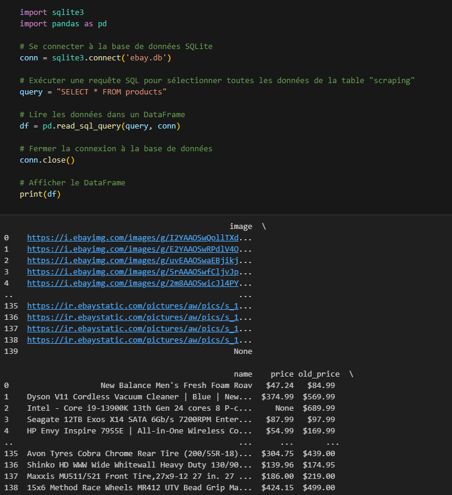

# Projet de Scraping eBay avec Scrapy

Ce projet utilise le framework Scrapy pour extraire des informations à partir de la page des offres eBay.

## Structure du Projet

Le projet est organisé comme suit :

- **ScrapEbay/** : Répertoire racine du projet.
  - **ScrapEbay/** : Module principal du projet.
    - **items.py** : Définition des items pour stocker les données extraites.
    - **pipelines.py** : Implémentation des pipelines de traitement des données.
    - **settings.py** : Configuration du projet Scrapy.
    - **spiders/** : Répertoire contenant les spiders Scrapy.
      - **ebay_spider.py** : Spider principal pour extraire les données eBay.
- **scrapy.cfg** : Fichier de configuration Scrapy.
- **ebay.db** : Base de données SQLite pour stocker les données extraites.

## Fonctionnement

### Spider eBay

Le spider `ebay_spider` est responsable de parcourir la page des offres eBay et d'extraire les informations pertinentes sur chaque produit, telles que l'image, le nom, le prix, le prix précédent et la réduction.

### Items

Les items sont définis dans le fichier `items.py`. Chaque item correspond à un produit eBay et comprend les champs suivants :
- `image` : URL de l'image du produit.
- `name` : Nom du produit.
- `price` : Prix actuel du produit.
- `old_price` : Prix précédent du produit (s'il existe).
- `discount` : Montant de la réduction du produit (s'il existe).

### Pipeline

Les données extraites par le spider sont envoyées au pipeline `EbayPipeline` pour être traitées avant d'être stockées dans la base de données SQLite `ebay.db`. Le pipeline gère notamment l'insertion des données dans la base de données.

## Configuration

Le pipeline `EbayPipeline` est activé dans le fichier `settings.py` avec la priorité 300. Cette priorité indique l'ordre dans lequel les pipelines sont exécutés, et une priorité de 300 signifie que ce pipeline sera exécuté après d'autres pipelines ayant une priorité inférieure.

## Jupyter Notebook 
### Résultats de Scraping eBay

## Lancement 
### Lancement local

Pour lancer le scraping en local, exécutez la commande suivante dans votre terminal : `scrapy crawl ebay_spider`

### Lancement Docker

Pour lancer le scraping à l'aide de Docker, suivez ces étapes :

1. Naviguez vers le répertoire `ScrapEbay` en utilisant la commande `cd ScrapEbay`.

2. Construisez l'image Docker en exécutant la commande suivante : `docker build -t scrapy-ebay .`

3. Une fois l'image construite, lancez un conteneur Docker en exécutant la commande suivante : `docker run scrapy-ebay`

Cela lancera le scraping dans un conteneur Docker isolé.

Assurez-vous d'avoir Docker installé sur votre système et d'avoir les droits d'exécution nécessaires pour lancer des conteneurs.

